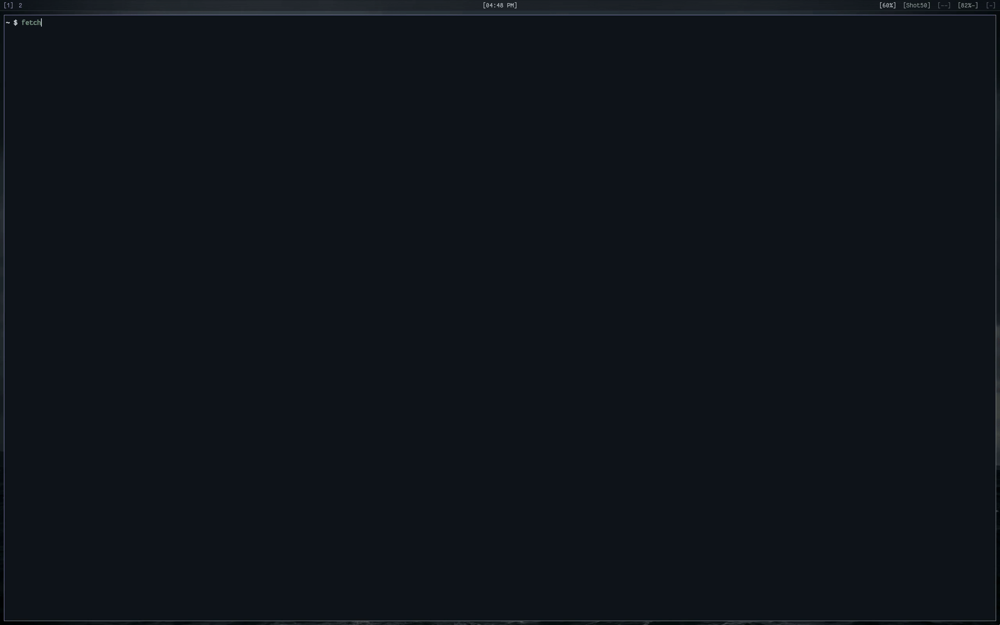

# fetch

A donut.c-inspired fetch tool that spins your distro logo in 3D with live-updating system info.



Takes any ASCII/Unicode distro logo, turns each character into a point cloud
based on its visual density, and renders it as a rotating 3D relief with
Blinn-Phong shading. System info is gathered natively with no external
dependencies. Works on Linux and macOS.

Based on [gentoo.c](https://github.com/areofyl/gentoo.c).

## Build & run

```
make
./fetch
```

By default it runs in pinned mode: the logo keeps spinning at the top of
the terminal and the rows below it go back to the shell, so you can keep
working while it turns. It runs detached until you run `fetch --unpin`,
run `fetch` again, or close the shell that started it. It works by setting
a terminal scroll region, so it's best effort: full-screen programs (vim,
less, htop) and `reset` draw over it or undo it, and very chatty output can
occasionally leave a stray glyph. If the terminal is too short (under 18
rows) or output isn't a terminal, it falls back to the classic mode below.

To make `clear` and Ctrl-L get rid of the logo, add the shell hooks to your
rc file (the logo is drawn by a detached process that can't see what the
shell prints, so the shell has to tell it):

```
eval "$(fetch --init bash)"   # ~/.bashrc
eval "$(fetch --init zsh)"    # ~/.zshrc
fetch --init fish | source    # ~/.config/fish/config.fish
```

### Classic mode

```
./fetch --no-pinned
```

Takes over the screen until you press a key. The keypress passes through to
the shell, so it works as a startup fetch. Ctrl-C works too (but is less
cool). Click and drag the logo to rotate it by hand, release to fling it
spinning. Set `pinned=0` in the config to make this the default.

## Install

```
sudo make install
```

`PREFIX=~/.local make install` if you don't want it system-wide.

<details>
<summary><h2>Package managers</h2></summary>

### Arch Linux (AUR)
Maintainer: [@PlayRood32](https://github.com/PlayRood32)

You can install `fetch-git` from the AUR using your favorite AUR helper:

```bash
yay -S fetch-git
```
or
```bash
paru -S fetch-git
```

*The `fetch-git` AUR package was not compromised in the AUR package hack. It is maintained and up to date.*

### Nix
Maintainer: [@Ghastrum](https://github.com/Ghastrum)

Fetch is available in **[nixpkgs unstable](https://search.nixos.org/packages?channel=unstable&query=fetch#show=fetch)**, or as a [flake](https://github.com/areofyl/fetch/tree/main/nix).

**Try out fetch!**
```
nix-shell -p fetch
```

Add to your ```configuration.nix``` or ```home.nix```.

```nix
environment.systemPackages = [
  ...
  pkgs.fetch
  ...
];
```

### Homebrew (macOS)
Maintainer: [@areofyl](https://github.com/areofyl)

```bash
brew tap areofyl/fetch
brew install fetch-git
```

### Fedora Linux
Maintainer: [@RealOrangeKun](https://github.com/RealOrangeKun)

You can install `fetch` from COPR:

```bash
sudo dnf copr enable realorangekun/fetch
sudo dnf install fetch
```

Or build an RPM package locally:

```bash
sudo dnf install @development-tools
rpmbuild -ba fetch.spec
sudo dnf install ~/rpmbuild/RPMS/*/fetch-*.rpm
```

### openSUSE
Maintainer: [@RealOrangeKun](https://github.com/RealOrangeKun)

You can install `fetch` from the Open Build Service:

```bash
sudo zypper addrepo https://download.opensuse.org/repositories/home:RealOrangeKun/openSUSE_Tumbleweed/home:RealOrangeKun.repo
sudo zypper refresh
sudo zypper install fetch
```

Or build an RPM package locally:

```bash
sudo zypper install -t pattern devel_basis
rpmbuild -ba fetch.spec
sudo zypper install ~/rpmbuild/RPMS/*/fetch-*.rpm
```

### Ubuntu / Debian
Maintainer: [@RealOrangeKun](https://github.com/RealOrangeKun)

You can install `fetch` from the PPA:

```bash
sudo add-apt-repository ppa:realorangekun/fetch
sudo apt update
sudo apt install fetch
```

Or build a `.deb` package locally:

```bash
sudo apt install build-essential devscripts debhelper
dpkg-buildpackage -us -uc -b
sudo apt install ../fetch_*.deb
```

Or install it with `pacstall`:
```
pacstall -I fetch-git
```

### Gentoo Linux (GURU)
Maintainer: [@Leb02](https://github.com/Leb02)

You can install `fetch` from the GURU repository using:

```bash
eselect repository enable guru
emaint sync -r guru
emerge -a app-misc/fetch
```

As for all GURU packages, you will have to add the package in your `package.accept\_keywords` directory if `~arch` is not already set.

</details>

## Logos

Custom logos: [docs/custom-logos.md](docs/custom-logos.md)

By default it auto-detects your distro and grabs the logo from fastfetch
(if installed) with its original per-character colors preserved. Works with
any of fastfetch's 500+ distro logos!

You can also specify one directly:

```
./fetch -l arch
./fetch -l NixOS
./fetch -l asahi
```

Or drop a custom logo in `~/.config/fetch/logo.txt`:

```
# distro: gentoo
         -/oyddmdhs+:.
     -odNMMMMMMMMNNmhy+-`
...
```

Without fastfetch, the built-in Gentoo logo is used.

## System info

All system info is gathered natively. No fastfetch or neofetch needed:

- **OS** - `/etc/os-release`
- **Host** - `/proc/device-tree/model` or `/sys/class/dmi/id/product_name`
- **Kernel** - `uname()`
- **Uptime** - `/proc/uptime`
- **Packages** - emerge, pacman, dpkg, rpm, xbps, apk, flatpak, brew, nixpkgs
- **Shell** - parent process detection (not just `$SHELL`)
- **Display** - per-connector DRM enumeration (multi-monitor): active resolution and refresh rate from the CRTC mode, monitor name and physical size from EDID, built-in vs external
- **WM** - process scanning + DE-to-WM mapping
- **Display Manager** - process scanning
- **Theme/Icons/Font** - `~/.config/gtk-3.0/settings.ini`, `~/.gtkrc-2.0`, and Qt (`qt6ct`/`qt5ct`, `~/.config/kdeglobals`) on Linux, `defaults read` (macOS)
- **Cursor** - `~/.config/gtk-3.0/settings.ini` (Linux only)
- **CPU** - `/proc/cpuinfo`, device-tree (Apple Silicon), or `sysctl` (macOS)
- **GPU** - DRM + `lspci` for full names (Linux), `system_profiler` (macOS)
- **Memory/Swap** - `/proc/meminfo` (Linux), `vm_stat` (macOS)
- **Disk** - `statvfs()` + `/proc/mounts` (Linux), `getmntinfo` (macOS) – supports multiple mount points via config
- **Battery** - `energy_now/energy_full` plus `model_name` (Linux), IOKit (macOS)
- **Power Profile** - `/sys/firmware/acpi/platform_profile`, fallback `powerprofilesctl get 2>/dev/null` (Linux)
- **Local IP** - `getifaddrs()`

Stats like memory, battery, and uptime update in real-time while the logo spins.

## Config

Full reference: [docs/configuration.md](docs/configuration.md)

Create `~/.config/fetch/config` to customize:

```
# fields – list to show, in this order
# remove or comment out to hide
os
host
kernel
uptime
packages
shell
display
wm
displaymanager
theme
icons
font
cursor
terminal
cpu
gpu
memory
swap
disk
ip
battery
powerprofile
locale
colors

# separators (blank line between groups)
# ---

# custom static fields
# custom_Pronouns=he/him
# custom_Website=example.com

# extra disks (add more mount points)
# disk=/home
# disk=/data

# appearance
# label_color=magenta   (red, green, yellow, blue, magenta, cyan, white)
# separator=─           (character for the title separator)
# shading=░▒▓█          (block shading ramp instead of braille, supports UTF-8)
# box=0                 (adds a box around the system-data, 0 = off, 1 = on)
# pinned=1              (run in --pinned mode, 0 = off, 1 = on)

# logo colors (override distro defaults)
# logo_outer=magenta    (extruded side color)
# logo_inner=white      (front/back face color)

# 3d
# light=top-left        (top-left, top-right, top, left, right, front, bottom-left, bottom-right)
# speed=1.0             (rotation speed)
# size=1.0              (logo scale, e.g. 2.0 for double size)
# depth=1.0             (3D extrusion depth, e.g. 3.0 for chunkier look)
# height=36             (override render height in rows)
# v_alignment=top       (top, center, bottom)
# h_alignment=left      (left, center, right)
```

## Options

| Flag | Description |
|------|-------------|
| `-l`, `--logo <name>` | Use a logo from fastfetch by name |
| `-s`, `--speed <float>` | Speed multiplier (default 1.0) |
| `--size <float>` | Scale the logo (e.g. 2.0 for double size) |
| `--depth <float>` | Scale the 3D depth (default 1.0) |
| `--height <n>` | Override render height in rows |
| `--box` | Draw a border box around the info block |
| `--no-info` | Just the logo, no system info |
| `--no-color` | Disable coloring |
| `--frames <n>` | Stop after n frames |
| `--infinite` | Run forever |
| `--pinned` | Keep spinning at the top of the terminal while you use the shell below (default) |
| `--no-pinned` | Classic mode: take over the screen until a keypress |
| `--unpin` | Stop the pinned logo on this terminal |
| `--init <shell>` | Print hooks that make `clear` and Ctrl-L stop the pinned logo (`bash`, `zsh`, `fish`) |
| `--shading-chars <str>` | Draw with blocks and this shading ramp instead of braille, supports UTF-8 (e.g. `░▒▓█`) |
| `-h`, `--help` | Show help |
| `-V`, `--version` | Show version |

CLI flags override config file settings.

## Shading

Full reference: [docs/shading-modes.md](docs/shading-modes.md)

By default coverage is sampled on a 2×4 grid per cell and drawn as braille
dots, with lighting done by ordered dithering — four times the resolution of
the character grid. Setting a shading ramp (e.g. `--shading-chars "░▒▓█"`)
switches to block mode: a 2×2 grid drawn with Unicode quadrant blocks and
ramp shades. Works on any terminal with a UTF-8 locale.


## Contributing

PRs are welcome! If you want to add a feature, fix a bug, or package fetch for
your distro, go for it. I try to keep the codebase small and easy to understand,
so smaller PRs are easier to merge than big ones.

If you want to chat about ideas before writing code, reach out on
[Reddit](https://www.reddit.com/user/areofyl) or open an issue.

## How it works

For a deep dive with visuals and code, see the [full blog post](https://asdesai.com/blog/how-fetch-works/).

1. **Logo loading** – reads ASCII/Unicode art from `~/.config/fetch/logo.txt` or
   grabs a distro logo via fastfetch. ANSI color codes are parsed and preserved
   per-character.

2. **Heightmap** – each character gets a weight based on visual density (`@` is
   heavy, `.` is light, `█` is full, `░` is thin). The weight becomes a Z height,
   turning the flat logo into a 3D relief map. Logos with low height variance
   (uniform characters) get their depth auto-scaled so they don't look flat.

3. **Point cloud** – the heightmap is sampled into 3D points. Interior cells get
   multiple Z layers for a solid extrusion, edge cells get only front and back
   faces to keep outlines clean.

4. **Surface normals** – computed from the height gradient at each cell using
   finite differences, giving each point a direction for lighting.

5. **Rotation + projection** – every frame, all points are rotated around the
   Y axis, then perspective-projected onto the terminal grid with a z-buffer
   to handle occlusion.

6. **Shading** – Blinn-Phong lighting (diffuse + specular) gives every visible
   point a brightness. Coverage is sampled on a 2×2 grid per character cell,
   and each cell picks whichever glyph carries the right amount of ink: a shade
   block (`░▒▓█`) where the cell is filled, a quadrant block where the
   silhouette cuts through it. So an edge lands on half a cell instead of
   snapping to the character grid.

   Logos that ship their own colors keep them. The rest are two-toned by
   surface: front and back faces in `logo_inner`, extruded sides in
   `logo_outer`.

7. **Rendering** – the entire frame is written in a single `write()` syscall to
   avoid flicker. System info is displayed alongside the animation and
   fast-changing fields (uptime, memory, swap) update live every second.
   In pinned mode a scroll region keeps the shell below the logo, and each
   frame is wrapped in a cursor save/restore so the shell's cursor stays put.

Single file C, no dependencies beyond libm.
