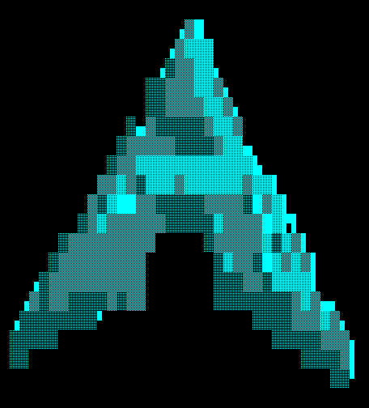

# Shading

fetch renders the 3D logo in one of two modes.

## Braille (default)

Coverage is sampled on a 2x4 grid per cell and each sample becomes one dot of a braille glyph (`⠁⠃⠇⡇⣇⣧⣷⣿`...), which gives the logo four times the resolution of a plain character grid. Braille has no shades, so lighting is done with ordered (Bayer) dithering: brighter surfaces light more dots, shadowed ones fewer.

Works on any terminal with a UTF-8 locale and a font with braille glyphs (virtually all of them).

## Blocks

Setting a shading ramp switches to block mode. Coverage is sampled on a 2x2 grid per cell. Each cell then picks whichever glyph carries the right amount of ink: a shade from the ramp where the cell is filled, or a quadrant block (`▘▝▀▖▌▞▛▗▚▐▜▄▙▟█`) where the silhouette cuts through it. Edges land on half-cell boundaries instead of snapping to the character grid.



To get the classic block look back, set the ramp in `~/.config/fetch/config`, dimmest to brightest:

```
shading=░▒▓█
```

Or on the command line:

```
fetch --shading-chars "░▒▓█"
fetch --shading-chars ".:-=+*#%@"
```
